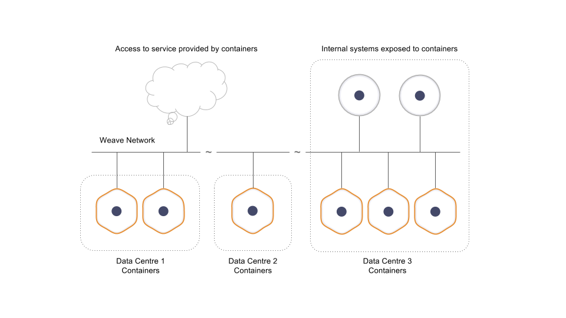

# Tutorial on using Weave Net for Docker networking
## Introducing Weave Net
 - From weaveworks:
 
 > Weave Net creates a virtual network that connects Docker containers across multiple hosts and enables their automatic discovery. With Weave Net, portable microservices-based applications consisting of multiple containers can run anywhere: on one host, multiple hosts or even across cloud providers and data centers. Applications use the network just as if the containers were all plugged into the same network switch, without having to configure port mappings, ambassadors or links.
Services provided by application containers on the weave network can be exposed to the outside world, regardless of where they are running. Similarly, existing internal systems can be opened to accept connections from application containers irrespective of their location..



### Instructions to run Weave Net
*Require Docker (version 1.6.0 or later)*
 
#### Install
 
```bash
$ sudo curl -L git.io/weave -o /usr/local/bin/weave
$ sudo chmod a+x /usr/local/bin/weave
```

#### Launching Weave Net
 
  - On `$HOST1` run:
```bash
host1$ sudo -s
host1$ weave launch
host1$ eval $(weave env)
host1$ docker run --name a1 -ti weaveworks/ubuntu
```

#### Creating Peer Connections Between Hosts
 
```bash
host2$ weave launch $HOST1
host2$ eval $(weave env)
host2$ docker run --name a2 -ti weaveworks/ubuntu
```

#### Testing Container Communications
 
  - From the container started on `$HOST1`
```bash
root@a1:/# ping -c 1 -q a2
PING a2.weave.local (10.40.0.2) 56(84) bytes of data.
--- a2.weave.local ping statistics ---
1 packets transmitted, 1 received, 0% packet loss, time 0ms
rtt min/avg/max/mdev = 0.341/0.341/0.341/0.000 ms
```
  - Similarly, in the container started on `$HOST2`
```bash
root@a2:/# ping -c 1 -q a1
PING a1.weave.local (10.32.0.2) 56(84) bytes of data.
--- a1.weave.local ping statistics ---
1 packets transmitted, 1 received, 0% packet loss, time 0ms
rtt min/avg/max/mdev = 0.366/0.366/0.366/0.000 ms
```

# Run Weave Net with Kubernetes in Just One Line
#### Install Weave Net
```bash
$ kubectl apply -f https://git.io/weave-kube
```
 - This one-liner will create a DaemonSet, a Kubernetes feature that runs one instance on each node
#### Check Weave Net
```bash
$ kubectl get pods --all-namespaces
    NAMESPACE     NAME              READY     STATUS    RESTARTS   AGE
    [...]
    kube-system   weave-net-4mylt   2/2       Running   0          18m
    kube-system   weave-net-dwueb   2/2       Running   0          18m
    kube-system   weave-net-tj1xv   2/2       Running   0          18m
```
 - all pods that Kubernetes starts will be attached to the Weave network
```bash
 $ kubectl run --image=weaveworks/hello-world hello
    $ kubectl get pods -o wide
    NAME                     READY STATUS   RESTARTS  AGE  IP
    hello-2533203682-5opib   1/1   Running  0         9s   10.32.0.2
```
 - We can see that the IP address of this pod is within Weave’s default range.
